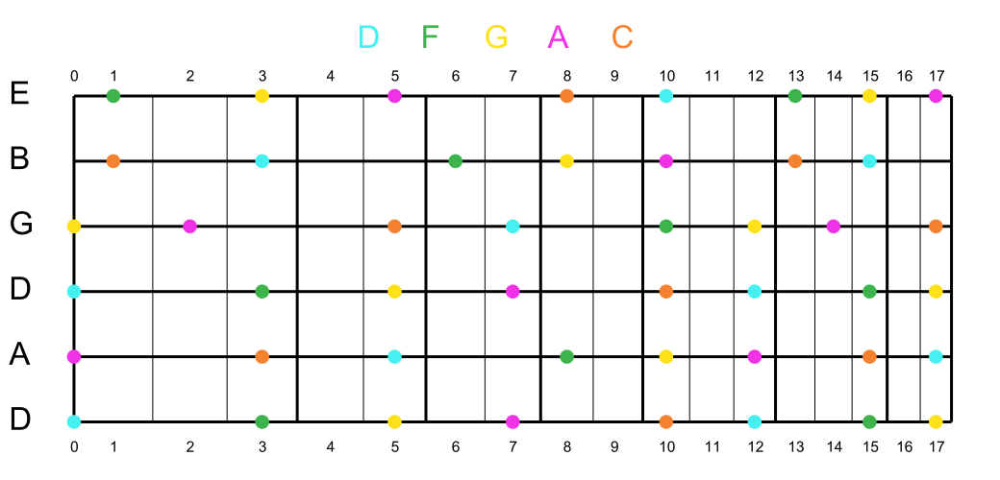
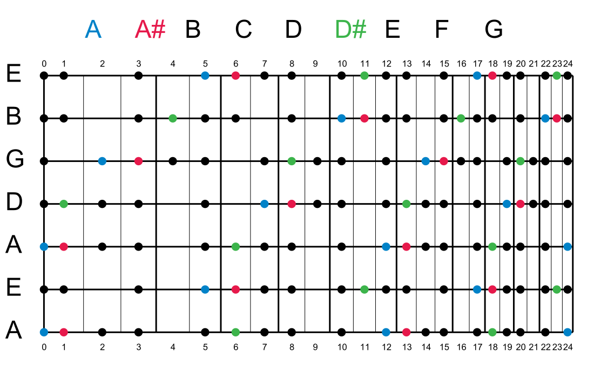
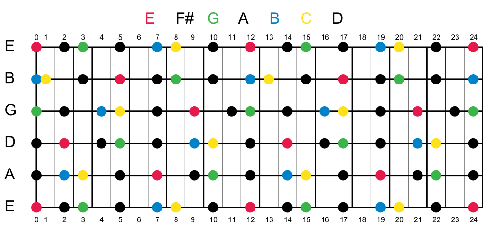

# Fretboard Scale Images

This is a python program that displays color coded musical scales on a fretboard for any fretted stringed instrument. Any scale consisting of any subset of [A, A#, B, C, C#, D, D#, E, F, F#, G, G#] can be input. The number of strings, number of frets, tuning, and color coding are configurable.

I was inspired to write this program after watching [this video](https://www.youtube.com/watch?v=wts2Mw6Nb5s) and experimenting with the idea. I made one of these scales by hand on a piece of paper for E minor. I screwed up twice and had to completely restart, so it took about one very frustrating hour to make. However, that piece of paper has been so helpful over the past month I've had it. I've come up with some riffs I don't think I would have ever found without it. So, I decided to write this program. This program makes it extremely easy and fast to generate an Allan Holdsworth-like scale image for any scale for any fretted string instrument. I hope you enjoy it as much as me!

## Setup Instructions

### Linux

If you're using Linux, I'm going to assume you know what you're doing. Clone this repo, then move on to the next section!

### Windows/macOS

If you're using Windows or macOS, you might still know what you're doing. If that's you, clone the repo and move on! Otherwise, I'll walk you through my preferred way of running this program on Windows/macOS. It's a bit of a pain, but you only have to do most of this setup one time. Scroll down to the [Examples](#Examples) section to see why it's worth it! I will try my very best to spare you all the boring tech details, but some are unavoidable. I will keep it brief when it must be done.

Also, I don't know anything about the macOS UI, so if you're using a Mac you'll have to do the Mac equivalent of Windows menu navigation, but once you get past step 2 everything is the same.

1) Install the Anaconda Prompt from the following link: [https://docs.anaconda.com/anaconda/install/windows/](https://docs.anaconda.com/anaconda/install/windows/). That webpage will guide you to the installation link. We want to download the "Python 3" version of Anaconda. As of writing this, the webpage has the "Python 3.7 version". Click the "Download" button below that. Go to your Downloads folder and double click the file you downloaded to run the Anaconda install.  

2) Search for "Anaconda" in your Windows search bar next to the Start Menu. Start the Anaconda Prompt app. A terminal will appear, and it will say something like "(base) C:\Users\YourName". You can type in this terminal. We are going to run 3 Anaconda commands to set up a special environment for this project. They will install various software packages that are required for this project to work, and some nice to have terminal features. The 3 commands are listed as steps 3, 4 and 5. Run these in order by copy/pasting or typing them into the Anaconda prompt and pressing enter. Each command may take a couple minutes to finish. You'll see a bunch of text appear after running these and new terminals might appear briefly, don't worry about it.

3) conda create -y -n fretboard

4) conda activate fretboard

5) conda install -y -c conda-forge numpy=1.17.4 pycairo=1.18.2 m2-base git

6) Now, open your file explorer and pick a folder for this program to live. You can put it anywhere, just make sure its a folder you can remember. I'm going to assume you picked C:\Users\YourName\Documents\fretboard\ for the rest of these instructions.

7) We are now going to download this program from this website to the folder you just picked. Run step 8 in the terminal to do this.

8) git clone https://github.com/atpjpta/fretboard_scale_images.git C:\Users\YourName\Documents\fretboard

9) The final stretch! We are now going to navigate to the folder you just downloaded the program to in the Anaconda prompt. The following command will do just that. "cd" is a command that stands for "change directory" and it will go to any folder path you pass to it. Run the command in step 10 in the Anaconda Prompt to go to your folder.

10) cd C:\Users\YourName\Documents\fretboard

You are now ready to run the project! Type "ls" in the terminal to list the files in your folder. You'll see a few things, but [fretboard_scale_images.py](./fretboard_scale_images.py) is the program you will run. 

Whenever you want to get back to this point in the future, simply open the Anaconda Prompt and run the following commands:

1) conda activate fretboard

2) cd C:\Users\YourName\Documents\fretboard

Type "python fretboard_scale_images.py --help" into your Anaconda prompt to see a short description of how to use the program. Scroll down to see [some examples](#Examples) of how to run the program, along with a [complete description of how to use it](#Running-the-program). Thanks for making it this far, have fun!

## Dependencies:

pycairo 1.18.2  
numpy 1.17.4

## Running the program

python fretboard_scale_image.py [--help] -s NUM_STRINGS -f NUM_FRETS -t TUNING -n SCALE_NOTES -p SAVE_PATH [-c NOTE_COLORS] [-w IM_WIDTH] [-h IM_HEIGHT] [-m MARKER_RADIUS_MULTIPLIER] [-r REALISTIC_SPACING] [-d DARK_MODE]

### Required program inputs:

-s: Number of strings on your fretted instrument

-f: Number of frets on your fretted instrument

-t: A comma separated list of the notes your instrument is tuned to starting from lowest string

-n: A comma separated list of notes in your scale. 

-p: File path to save image to. Can be a .pdf, .png, or .svg file. File type for saving is deduced from this input.

### Optional program inputs:

-c: The colors to draw the scale notes in. There are three options for specifying note colors.
                            
1) It can be left blank. All scale notes will be drawn in black by default.
                            
2) A comma separated list of note:color pairs. For example, specifying the following will draw E notes in red, G notes in blue, C notes in teal, and any unspecified notes in black:
    -c e:r,g:b,c:t
                            
3) A comma separated list of colors for each note in your scale in the same order as your scale. A color must be specified for each note if this format is used. 

Duplicate colors are allowed for both options 2 and 3. The following colors are available:  
    r - red  
    o - orange  
    y - yellow  
    g - green  
    c - cyan  
    b - blue  
    m - magenta  
    t - teal  
    k - black # MATLAB haunts me  
    p - pink  
    l - lavender  
    n - navy  
    w - white  

These colors were chosen because they can be easily abbreviated by 1 letter and supposedly [can be easily distinguished by 95% of population](https://sashat.me/2017/01/11/list-of-20-simple-distinct-colors/)
    
-w: Output image width in points (For printing purposes, 1 point = 1/72 inch)

-h: Output image height in points

-m: Multiplier for note marker radius. Must be greater than 0.

-r: Turn realistic fretboard spacing on or off. Maybe be useful if you want to make note markers bigger. It can be specified as any of the following:
    On  - yes, true, t, y, 1  
    Off - no, false, f, n, 0  

-d: Turn dark mode on or off. It can be specified as any of the following:
    On  - yes, true, t, y, 1  
    Off - no, false, f, n, 0 
    
## Examples

E Minor is [E, F#, G, A, B, C, D]. Let's say we want to highlight the root, the minor third, the fifth, and the minor sixth, so [E, G, B, C]. We want to highlight these notes as red, green, blue, and yellow respectively. We will do this for a 6 string guitar with 24 frets in standard tuning. If you do not understand these command line arguments, please scroll up and read the Arguments section. This will save a file named e_minor_standard.svg in your current folder. You can open it in a browser by double clicking on it in your file explorer. If you'd prefer, you can change the extension to .pdf or .png and open it with a PDF of PNG viewer. Notice that the notes we did not specify a color for are black by default.

`python fretboard_scale_image.py -s 6 -f 24 -t e,a,d,g,b,e -n e,f#,g,a,b,c,d -c e:r,g:g,b:b,c:y -p e_minor_standard.svg`

D Minor is [D, E, F, G, A, A#, C]. This time let's highlight the pentatonic minor scale within D Minor, so [D, F, G, A, C]. We will use the colors cyan, green, yellow, magenta, and orange respectively. We will specify a default color of black for the other notes. We will do this for a 6 string guitar with 17 frets in drop D tuning.

`python fretboard_scale_image.py -s 6 -f 17 -t d,a,d,g,b,e -n d,e,f,g,a,a#,c -c c,k,g,y,m,k,o -p d_minor_drop_d.svg`

Notice that this time we specified a color for each note in the notes list. These colors are applied in order. If you don't like that unspecified notes default to black when using note:colors pairs, this would be the way to specify colors.

Let's say you like the color scheme we just chose for D Pentatonic Minor, but you don't like that E and A# show up as black circles. We can easily remove them like so:

`python fretboard_scale_image.py -s 6 -f 17 -t d,a,d,g,b,e -n d,f,g,a,c -c d:c,f:g,g:y,a:m,c:o -p d_pentatonic_minor_drop_d.svg`

Let's take a look at the ["Metallica Scale"](https://www.youtube.com/watch?v=UuqvZDDm_bk) for A minor. The "Metallica Scale" is just taking a minor scale and adding in a minor 2nd (flat 2, A# in A Minor) and a tritone (flat 5th, D# in A Minor). So, we have [A, A#, B, C, D, D#, E, F, G]. Let's highlight the root in blue, the minor 2nd in red and the tritone in green. We will do this for a 7 string guitar with 24 frets tuned to drop A. Let's also change the image size for illustrative purposes.

`python fretboard_scale_image.py -s 7 -f 24 -t a,e,a,d,g,b,e -n a,a#,b,c,d,d#,e,f,g -c a:b,a#:r,d#:g -p a_metallica_scale_drop_a.svg -w 1100 -h 700`

You can also turn off realistic fret spacing and change note marker sizes. Let's do this for an E Minor scale:

`python fretboard_scale_image.py -s 6 -f 24 -t e,a,d,g,b,e -n e,f#,g,a,b,c,d -c e:r,g:g,b:b,c:y -r false -m 1.5 -p e_minor_big_markers_even_spaced.svg`

Dark mode is available! Here it is for D Phrygian in Drop D:

`python fretboard_scale_image.py -s 6 -f 24 -t d,a,d,g,b,e -n d,d#,f,g,a,a#,c -c d:r,d#:y,f:c,a:b,a#:o -d -p d_phrygian_drop_d.svg`

